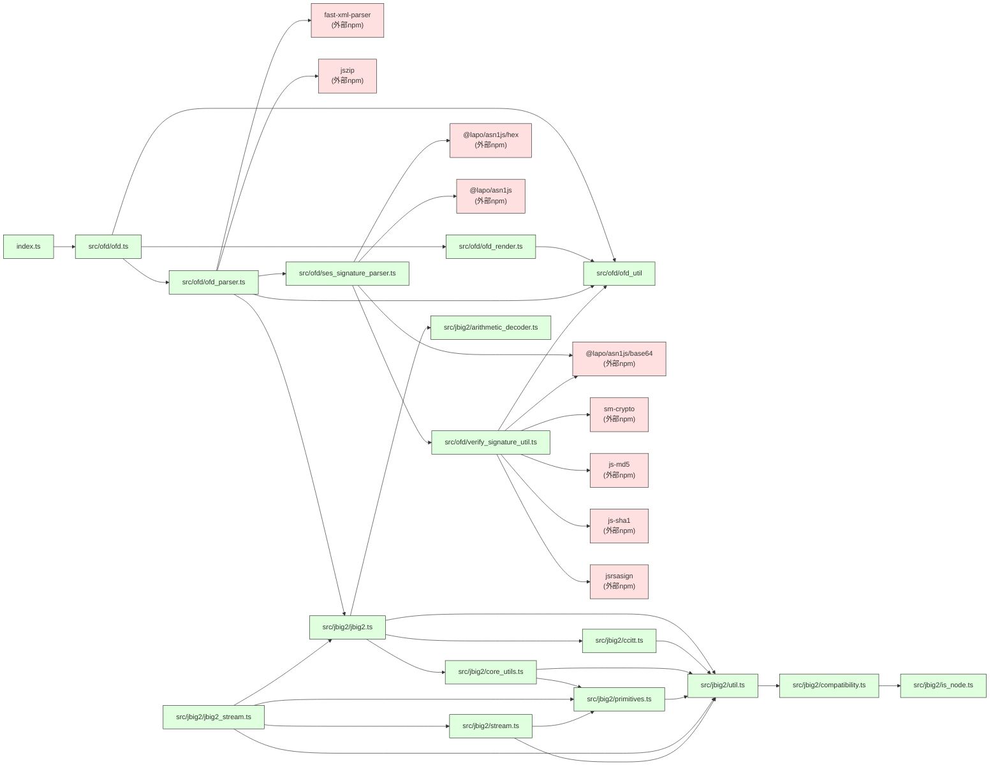

# ofd.js 源代码依赖树

本文档记录了 ofdts 项目的完整源代码依赖关系。

**生成日期**: 2026-07-07

## Mermaid 依赖图



## 分层依赖结构

### 入口层

```text
index.ts (入口)
  └── src/ofd/ofd.ts (主API导出)
```

### 核心层 - OFD 模块

```text
src/ofd/
├── ofd.ts (公共API)
│   ├── ofd_render.ts (页面渲染)
│   │   └── ofd_util.ts (工具函数/类型)
│   ├── ofd_parser.ts (文档解析)
│   │   ├── ofd_util.ts
│   │   ├── jbig2/jbig2.ts (JBIG2图像解码)
│   │   └── ses_signature_parser.ts (电子签名解析)
│   │       ├── verify_signature_util.ts (签名验证)
│   │       │   └── ofd_util.ts (sm3 from sm-crypto)
│   │       └── (外部ASN1库)
│   └── ofd_util.ts (公共工具)
```

### JBIG2 图像解码模块 (来源于 PDF.js 项目)

```text
src/jbig2/
├── jbig2.ts (主入口 - Jbig2Image)
│   ├── util.ts (基础工具/异常)
│   │   └── compatibility.ts (兼容性polyfills)
│   │       └── is_node.ts (环境检测)
│   ├── core_utils.ts (核心工具函数)
│   │   └── primitives.ts (PDF基本类型: Dict/Name/Ref)
│   │       └── util.ts
│   ├── arithmetic_decoder.ts (算术解码) - 独立
│   └── ccitt.ts (CCITT传真解码)
│       └── util.ts
├── jbig2_stream.ts (JBIG2流包装)
│   ├── primitives.ts
│   ├── stream.ts (基础流类)
│   │   └── primitives.ts
│   └── jbig2.ts
```

## 外部 NPM 依赖

```text
ofdts
├── 运行时依赖:
│   ├── core-js (3.49.0) - 兼容性 polyfills
│   ├── jszip (3.10.1) - ZIP 解压（OFD 是 ZIP 容器）
│   ├── fast-xml-parser (4.5.7) - XML 转 JSON（OFD 文件内部使用 XML）
│   ├── sm-crypto (0.4.0) - 国密 SM2/SM3 算法
│   └── web-streams-polyfill (4.3.0) - 流 polyfill
│
└── 开发依赖:
    ├── @eslint/js
    ├── @types/bun
    ├── @typescript-eslint/*
    ├── eslint
    ├── jest
    ├── jsdom
    ├── prettier
    └── vite
```

## 模块功能说明

| 模块                            | 职责                                                                           |
| ------------------------------- | ------------------------------------------------------------------------------ |
| `index.ts`                      | 公共 API 导出入口                                                              |
| `ofd.ts`                        | 主公共 API：`parseOfdDocument()`、`renderOfd()`、`renderOfdByScale()` 等       |
| `ofd_parser.ts`                 | 解析流水线：解压 → 获取文档根 → 解析文档 → 资源 → 模板页 → 内容页             |
| `ofd_render.ts`                 | 页面渲染：Canvas 渲染路径，SVG 渲染文本，DOM 渲染图像                          |
| `ofd_util.ts`                   | 坐标转换、颜色解析、路径处理、HTML 解码等工具                                  |
| `ses_signature_parser.ts`       | SES 电子签名 ASN.1 解码（支持 V1/V4）                                          |
| `verify_signature_util.ts`      | SM2/RSA 签名验证，SM3/MD5/SHA1 摘要验证（SM3 来自 `sm-crypto`）                 |
| `jbig2/jbig2.ts`                | JBIG2 二值图像压缩解码（用于印章图片）                                         |
| `jbig2/arithmetic_decoder.ts`   | QM Coder 算术解码（JBIG2 核心）                                                |
| `jbig2/ccitt.ts`                | CCITT 传真编码解码                                                             |
| `jbig2/*`                       | 其余模块来自 PDF.js 项目，提供流处理和基本数据类型支持                         |

## 循环依赖检测

✅ 本项目**没有循环依赖**，所有依赖都是单向的，依赖图是一个有向无环图 (DAG)。

## 统计信息

- **总 TypeScript 源文件数**: 20
  - src/ofd/: 8 个
  - src/jbig2/: 11 个
  - index.ts: 1 个
- **层级深度**: 最多 5 层嵌套
- **外部依赖数**: 9 个运行时依赖
