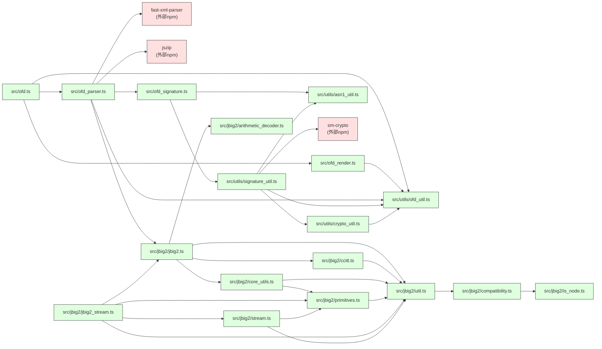

# ofd.js 源代码依赖树

本文档记录了 ofdts 项目的完整源代码依赖关系。

**生成日期**: 2026-07-09

## Mermaid 依赖图



## 分层依赖结构

### 入口层

```text
src/ofd.ts (入口 & 公共API)
```

### 核心层

```text
src/
├── ofd.ts (公共API)
│   ├── ofd_render.ts (页面渲染)
│   │   └── utils/ofd_util.ts (工具函数/类型)
│   └── ofd_parser.ts (文档解析)
│       ├── utils/ofd_util.ts
│       ├── jbig2/jbig2.ts (JBIG2图像解码)
│       └── ofd_signature.ts (电子签名解析)
│           ├── utils/asn1_util.ts (自实现 ASN.1 DER 解码)
│           └── utils/signature_util.ts (签名验证)
│               ├── crypto_util.ts (自实现 SHA1/MD5/RSA)
│               └── ofd_util.ts (sm3 from sm-crypto)
```

### 工具层

```text
src/utils/
├── ofd_util.ts            # 坐标转换、颜色解析、路径处理等
├── asn1_util.ts           # 轻量级 ASN.1 DER 解码器
├── crypto_util.ts         # SHA1/MD5/RSA PKCS#1 v1.5 自实现
└── signature_util.ts  # SM2/RSA 签名验证 + SM3/MD5/SHA1 摘要
```

### JBIG2 图像解码模块 (来源于 PDF.js 项目)

```text
src/jbig2/
├── jbig2.ts (主入口 - Jbig2Image)
│   ├── util.ts (基础工具/异常)
│   │   └── compatibility.ts (兼容性polyfills)
│   │       └── is_node.ts (环境检测)
│   ├── core_utils.ts (核心工具函数)
│   │   └── primitives.ts (PDF基本类型: Dict/Name/Ref)
│   │       └── util.ts
│   ├── arithmetic_decoder.ts (算术解码) - 独立
│   └── ccitt.ts (CCITT传真解码)
│       └── util.ts
├── jbig2_stream.ts (JBIG2流包装)
│   ├── primitives.ts
│   ├── stream.ts (基础流类)
│   │   └── primitives.ts
│   └── jbig2.ts
```

## 外部 NPM 依赖

```text
ofdts
├── 运行时依赖:
│   ├── jszip (3.10.1) - ZIP 解压（OFD 是 ZIP 容器）
│   ├── fast-xml-parser (5.9.3) - XML 转 JSON（OFD 文件内部使用 XML）
│   └── sm-crypto (0.4.0) - 国密 SM2/SM3 算法
│
└── 开发依赖:
    ├── @types/bun
    ├── @types/jsdom
    ├── jsdom
    ├── prettier
    └── vite
```

## 模块功能说明

| 模块                            | 职责                                                                              |
| ------------------------------- | --------------------------------------------------------------------------------- |
| `ofd.ts`                      | 主公共 API：`parseOfdDocument()`、`renderOfd()`、`renderOfdByScale()` 等    |
| `ofd_parser.ts`               | 解析流水线：解压 → 获取文档根 → 解析文档 → 资源 → 模板页 → 内容页            |
| `ofd_render.ts`               | 页面渲染：Canvas 渲染路径，SVG 渲染文本，DOM 渲染图像                             |
| `utils/ofd_util.ts`           | 坐标转换、颜色解析、路径处理、HTML 解码等工具                                     |
| `utils/asn1_util.ts`          | 轻量级 ASN.1 DER 解码器（替代`@lapo/asn1js`），支持 OID/INTEGER/OCTET STRING 等 |
| `utils/crypto_util.ts`        | SHA1/MD5/RSA PKCS#1 v1.5 自实现（替代 `js-md5`/`js-sha1`/`jsrsasign`）      |
| `ofd_signature.ts`     | SES 电子签名 ASN.1 解码（支持 V1/V4，支持 CMS ContentInfo 格式）                  |
| `utils/signature_util.ts` | SM2/RSA 签名验证，SM3/MD5/SHA1 摘要验证（SM3 来自`sm-crypto`）                  |
| `jbig2/jbig2.ts`              | JBIG2 二值图像压缩解码（用于印章图片）                                            |
| `jbig2/arithmetic_decoder.ts` | QM Coder 算术解码（JBIG2 核心）                                                   |
| `jbig2/ccitt.ts`              | CCITT 传真编码解码                                                                |
| `jbig2/*`                     | 其余模块来自 PDF.js 项目，提供流处理和基本数据类型支持                            |

## 循环依赖检测

✅ 本项目**没有循环依赖**，所有依赖都是单向的，依赖图是一个有向无环图 (DAG)。

## 统计信息

- **总 TypeScript 源文件数**: 22
  - src/: 4 个 (`ofd.ts`, `ofd_parser.ts`, `ofd_render.ts`, `ofd_signature.ts`)
  - src/utils/: 4 个
  - src/jbig2/: 11 个
  - sm-crypto.d.ts: 1 个（第三方类型声明）
- **层级深度**: 最多 6 层嵌套
- **外部依赖数**: 3 个运行时依赖（`core-js`/`web-streams-polyfill` 已移除，`js-md5`/`js-sha1`/`jsrsasign`/`@lapo/asn1js` 已替换为自实现）
